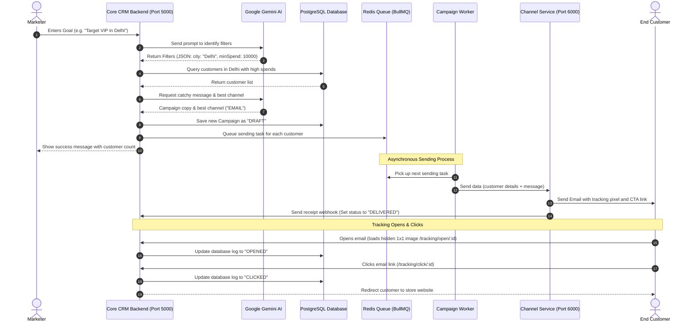

# EngageOS: AI-Powered Customer Intelligence & Marketing Automation Platform

## 📈 Real-Life Case Study: Why Do We Need This Tool?

Imagine a local clothing store owner named **Rohan**. Rohan has a database of 50,000 customers. With summer starting, Rohan wants to run a quick weekend sale to clear out his winter stock. He wants to send a special discount coupon only to customers who:
1. Live in **Mumbai** (where his physical store is located).
2. Have spent more than **5,000 Rupees** in his store before (his high-spending loyal customers).

### The Hard Way (Without EngageOS)
Rohan does not know how to code. To do this, he has to:
*   Call his software engineer.
*   Wait for the engineer to write a database query (SQL) to find these customers.
*   Ask the engineer to write a template email.
*   Set up a complex server script to send the emails (which might overload his computer and get blocked as spam).
*   Manually code email tracking to check who actually opened or clicked the coupon link.

This takes **several days**, costs a lot of developer money, and by the time it is set up, the weekend is already over!

### The Easy Way (With EngageOS)
Rohan opens EngageOS and types: *"Send a summer sale discount to my high-spending Mumbai customers."*
*   **Instantly**, the AI understands his words, filters the database, and finds the matching customers.
*   The AI writes a catching email subject and body for him.
*   The system schedules the emails and queues them safely.
*   Rohan can view a live dashboard showing the open rates and click rates of the coupon code.

Rohan completes the entire task in **under 2 minutes** without writing a single line of code!

---

## 🚀 Project Gist

EngageOS is a smart tool that I built to help businesses send marketing emails, SMS, and WhatsApp messages to their customers. 

Normally, if you want to send emails to specific customers, you have to write complex database queries. With EngageOS, you can just type a simple goal in plain English, like: *"Send a weekend discount offer to all VIP customers living in Delhi."* 

My system uses **Google Gemini AI** to understand your sentence, find the correct customers, write a catchy email draft, and send it out automatically.

EngageOS is composed of two primary services that I developed:
1. **Core Backend (Port 5000):** Manages customers, order histories, JWT-based authentication, dashboard analytics, campaign tracking, and hosts the autonomous AI Marketing Agent. It communicates with PostgreSQL and Redis.
2. **Channel Service (Port 6000):** A separate microservice dedicated to message delivery. It handles outbound SMTP emails via Nodemailer, embeds delivery tracking pixels, tracks link clicks, and simulates SMS/WhatsApp message delivery channels.

---

## 📖 Simple Definitions of Terms

If you are new to this project, here is what the technical terms mean in simple words:

*   **CRM (Customer Relationship Management):** A system or database used by companies to store information about their customers, like their names, emails, purchases, and cities.
*   **Google Gemini AI:** A smart AI assistant (like ChatGPT) that reads plain English sentences, picks out search filters, and writes email text.
*   **Database (PostgreSQL) & Prisma ORM:** PostgreSQL is the storage room where I save all customer details. Prisma is the helper tool that lets my Node.js code talk to the database easily.
*   **Message Queue (Redis & BullMQ):** If I send 10,000 emails at once, the server might crash. Redis and BullMQ act like a post office. They store the emails in a line (queue) and send them one by one safely in the background.
*   **Channel Service:** A separate, small app that has only one job: actually delivering the emails (using Gmail SMTP) or pretending to send SMS and WhatsApp messages.
*   **Tracking Pixel:** A tiny, invisible 1x1 image hidden inside the email. When the customer opens the email, their phone downloads this invisible image from my server. That is how I know they opened it!
*   **CTR (Click-Through Rate):** The percentage of customers who clicked the link inside my email compared to those who opened it.

---

## 🛠️ Technology Stack (What I Used)

I built this project using these main technologies:

1.  **Node.js & Express.js:** The main engine and framework used to build my backend servers.
2.  **PostgreSQL & Prisma:** Used to store and manage tables like Customers, Orders, and Campaigns.
3.  **Redis & BullMQ:** Used for managing the queue of emails so my server never gets overloaded.
4.  **Google Gemini AI (`gemini-2.5-flash`):** Used to read plain text goals, select the right customers, and write email copy.
5.  **Nodemailer:** The library used to log into Gmail SMTP and send the physical emails.
6.  **bcryptjs & JWT:** Used to secure passwords and let users log in safely.

---

## 📂 Project Folder Structure (Where is what?)

I split this project into two main folders: the main folder (CRM backend) and a sub-folder called `channel-service` (delivery service).

```
EngageOS/
├── backend/                  # Monorepo backend folder
│   ├── channel-service/      # Small service on Port 6000 that sends emails & mock messages
│   │   ├── controllers/      # Chooses if message is Email, SMS, or WhatsApp
│   │   ├── routes/           # Links incoming commands to the controller
│   │   ├── services/         # Sends emails using Nodemailer/Gmail SMTP
│   │   ├── server.js         # Starts the channel service
│   │   └── package.json      # Node libraries for the channel service
│   ├── controllers/          # Code files that run different features
│   │   ├── agentController.js    # AI Agent code (calls Gemini AI, filters customers)
│   │   ├── campaignController.js # Creates, schedules, and shows stats of campaigns
│   │   ├── customerController.js # Code to add customers and view orders
│   │   ├── authController.js     # User registration, logins, and OTP code verification
│   │   └── trackingController.js # Handles click tracking redirects and invisible open pixels
│   ├── middleware/           # Security checkers
│   │   └── authMiddleware.js # Checks if user is logged in before letting them see pages
│   ├── prisma/               # Database files
│   │   ├── schema.prisma     # List of tables (Customer, Order, User, OTP, Campaign)
│   │   └── prismaClient.js   # Reusable database connector code
│   ├── queues/               # Queues list
│   │   └── campaignQueue.js  # The queue code connecting to Redis
│   ├── routes/               # File paths mapping requests to controllers
│   ├── services/             # Helper services
│   │   ├── aiService.js      # The code that prompts and talks to Gemini AI
│   │   └── audienceService.js # Code that makes filters (like city = Delhi)
│   ├── workers/              # Background engines that run forever
│   │   ├── campaignWorker.js # Takes emails from Redis queue and hands them to Channel Service
│   │   └── schedulerWorker.js # Checks every 30 seconds if any campaign was scheduled to run later
│   ├── server.js             # Main file that starts my server on Port 5000
│   ├── requirement.py        # Automatic helper script I wrote to set up the project easily
│   └── package.json          # List of Node packages for the main app
├── frontend/                 # Monorepo frontend folder (placeholder)
└── README.md                 # Project documentation
```

---

## 🔄 How the System Works (Workflow)

Here is a step-by-step story of what happens when someone uses my EngageOS:

1.  **Typing a Goal:** The marketer types a goal (e.g. *"Target VIPs in Delhi"*).
2.  **AI Parsing:** The server sends this text to **Google Gemini AI**. The AI replies: *"The city is Delhi, and the customer segment is VIP."*
3.  **Filtering:** My server searches the database using Prisma for customers matching those filters.
4.  **Copywriting:** Gemini AI writes a catchy subject line and email body automatically.
5.  **Queueing:** For every customer found, the server makes a job ticket and pushes it into the **Redis Queue**.
6.  **Delivering:** The **Campaign Background Worker** picks up the tickets from Redis and forwards them to the **Channel Service**.
7.  **Sending:** The Channel Service emails the customer using **Nodemailer**. It embeds a secret redirect link and a tiny tracking pixel image I created.
8.  **Tracking:** 
    *   If the customer opens the email, their device downloads the invisible pixel, and the database status updates to `OPENED`.
    *   If they click the button in the email, they go through my server redirect route, and the database status updates to `CLICKED`.

---

## 📊 Visual Workflow Flowchart

This sequence flowchart shows how data flows through my system:



---

## ⚙️ Running Commands & Installation

### Step 1: Run the Setup Script
To make setting up easy, I created a Python helper script inside the backend directory. It will verify Node.js is on your computer, create template configuration files, and install all required files for both directories automatically.

First, navigate to the `backend/` directory:
```bash
cd backend
```

Then, run the setup script:
```bash
python requirement.py
```

### Step 2: Fill in Credentials
After running the script, you will see two new files called `.env` (in the `backend/` folder) and `channel-service/.env` (in the `backend/channel-service/` folder). Open them and fill in:
*   `DATABASE_URL`: Link to your PostgreSQL database.
*   `REDIS_URL`: Link to your running Redis server.
*   `GEMINI_API_KEY`: Your Google Gemini API Key.
*   `EMAIL_USER` & `EMAIL_PASS`: Gmail email and app password for sending emails.

### Step 3: Set up Database Tables
From the `backend/` directory, run this command to create the tables inside your PostgreSQL database:
```bash
npx prisma db push
```

### Step 4: Start All Servers
Navigate to the `backend/` directory and open separate terminal windows to run all parts of the app:

*   **Terminal 1 (Core CRM Backend API):**
    ```bash
    cd backend
    npm start
    ```
*   **Terminal 2 (Channel Delivery Microservice):**
    ```bash
    cd backend
    npm --prefix channel-service run dev
    ```
*   **Terminal 3 (Background Campaign Worker):**
    ```bash
    cd backend
    npm run worker
    ```
*   **Terminal 4 (Campaign Scheduler):**
    ```bash
    cd backend
    npm run scheduler
    ```

---

## 🧪 How Email Tracking Works under the Hood

When an email is sent out, my system injects tracking endpoints into the HTML. 

1.  **Tracking Opens:**
    ```html
    
    ```
    *How it works:* The email client loads this invisible image from my server. When my server gets the request, it updates the log status to `OPENED` in the database.

2.  **Tracking Clicks:**
    ```html
    <a href="http://localhost:5000/tracking/click/[logId]">View Offer</a>
    ```
    *How it works:* Instead of sending the customer directly to the main store website, the button link routes them through my backend tracking URL first. I change the database log status to `CLICKED` and then redirect the customer's browser to the destination website immediately.

---

This entire project was designed, coded, and tested by me as a solo developer to solve real-world marketing automation challenges.
