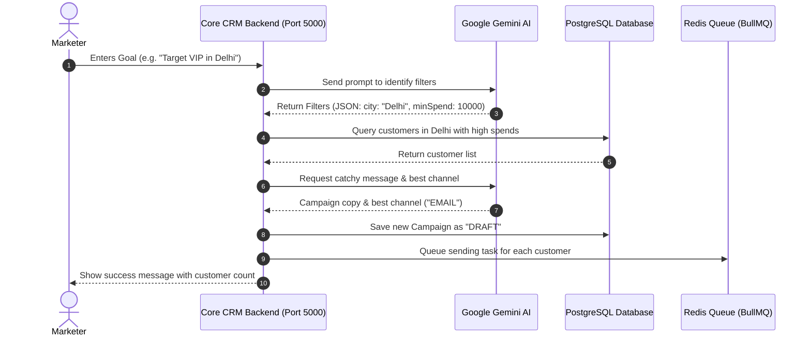
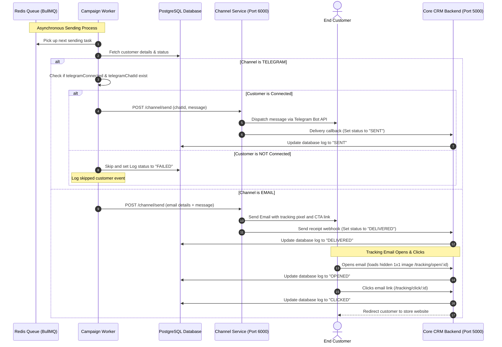
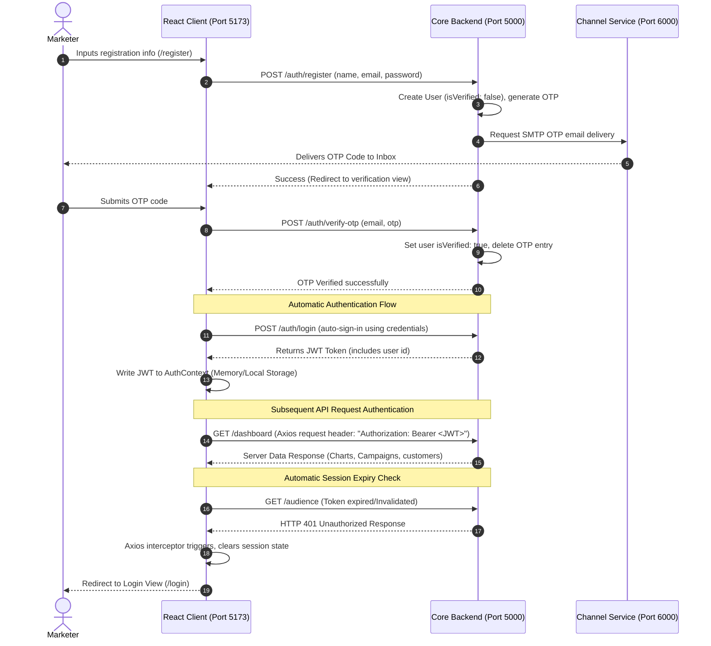
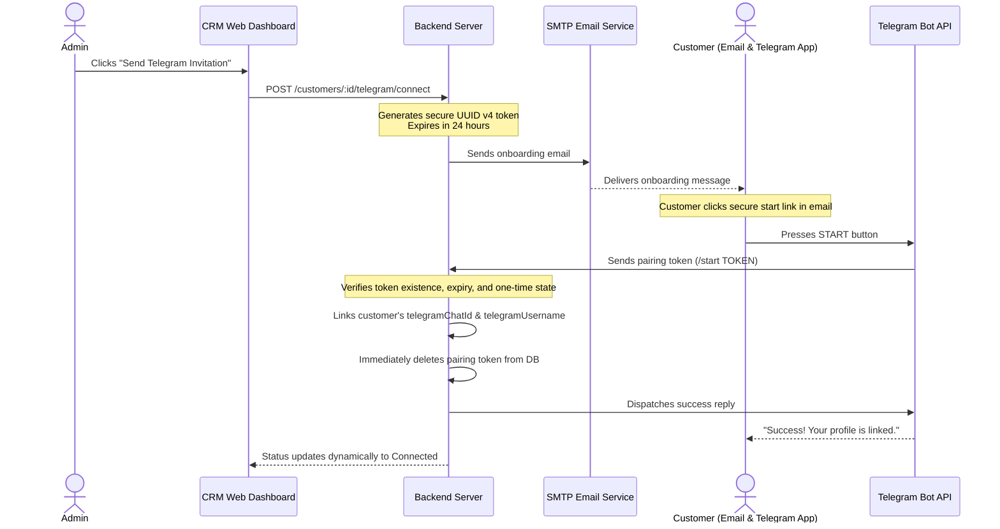

# EngageOS: AI-Powered Customer Intelligence & Marketing Automation Platform

## 📈 Real-Life Case Study: Why Do We Need This Tool?

Imagine a local clothing store owner named **Rohan**. Rohan has a database of 50,000 customers. With summer starting, Rohan wants to run a quick weekend sale to clear out his winter stock. He wants to send a special discount coupon only to customers who:
1. Live in **Mumbai** (where his physical store is located).
2. Have spent more than **5,000 Rupees** in his store before (his high-spending loyal customers).

### The Hard Way (Without EngageOS)
Rohan does not know how to code. To do this, he has to:
*   Call his software engineer.
*   Wait for the engineer to write a database query (SQL) to find these customers.
*   Ask the engineer to write a template email.
*   Set up a complex server script to send the emails (which might overload his computer and get blocked as spam).
*   Manually code email tracking to check who actually opened or clicked the coupon link.

This takes **several days**, costs a lot of developer money, and by the time it is set up, the weekend is already over!

### The Easy Way (With EngageOS)
Rohan opens EngageOS and types: *"Send a summer sale discount to my high-spending Mumbai customers."*
*   **Instantly**, the AI understands his words, filters the database, and finds the matching customers.
*   The AI writes a catching email subject and body for him.
*   The system schedules the emails and queues them safely.
*   Rohan can view a live dashboard showing the open rates and click rates of the coupon code.

Rohan completes the entire task in **under 2 minutes** without writing a single line of code!

---

## 🚀 Project Gist

EngageOS is an AI-powered customer intelligence and marketing automation platform. It allows businesses to run automated, multi-channel marketing campaigns using plain English goals (e.g., *"Send a weekend discount offer to all VIP customers living in Delhi"*).

The platform is designed around a **pluggable, decoupled multi-channel architecture**. Under this design, the core campaign orchestration, AI agent pipeline, and tracking logic remain completely channel-agnostic. Adding support for a new communication channel (like Telegram) or upgrading to a new provider simply requires implementing a single provider service inside the Channel Service, while leaving the rest of the backend and database schemas entirely unchanged.

The platform comprises three primary packages:
1. **Core Backend (Port 5000):** Manages CRM records, campaigns, dashboard statistics, session authentication, and hosts the autonomous AI Marketing Agent. Connects directly to PostgreSQL and Redis.
2. **Channel Service (Port 6000):** A delivery microservice that routes message requests to Nodemailer SMTP or mock channels, embedding tracking pixels and redirect hooks.
3. **React Enterprise Frontend (Port 5173):** A professional, responsive dashboard client featuring custom audience builders, AI campaign studio tracking, and chat-style analytics interfaces.

---

## 🔌 Communication Channels & Status

EngageOS features a modular, channel-agnostic delivery microservice (**Channel Service**). The core campaign scheduler and AI orchestration layers do not know how messages are delivered; they delegate to specific channel provider classes. 

*   **Extensible Adapter Design:** Adding a new channel only requires implementing a standardized provider class (under the `channel-service` package) and mapping it in the router.
*   **Decoupled Workflows:** Customer CRM records, database schemas, analytics logs, and campaign workflows remain completely unchanged when channels are added or swapped.

### Channel Integration Status

| Channel | Current Status | Implementation Level | Notes & Integration Details |
| :--- | :--- | :--- | :--- |
| **Email** | ✅ Fully Implemented | Production-Ready (SMTP) | Fully functional SMTP-based delivery using Nodemailer. Supports dynamic HTML campaigns, automated email open tracking via 1x1 tracking pixels, and click tracking via backend redirect hooks. |
| **SMS** | ⚠️ Architecture Implemented | Mock Delivery / API Ready | Core microservice routes and handler interfaces are fully implemented. Delivery uses a mock provider simulator; integration with a production SMS gateway (e.g., Twilio) is pending API key configuration. |
| **WhatsApp** | ⚠️ Architecture Implemented | Mock Delivery / API Ready | Core microservice routes and handler interfaces are fully implemented. Delivery uses a mock provider simulator; official Meta WhatsApp Cloud API integration is pending. |
| **Telegram** | ✅ Fully Implemented | Production-Ready (Onboarding) | Secure start-token flow via Telegram Bot. Supports automatic customer email invitation, automated pairing updates, and dynamic campaign message routing. |

---

## 💎 Key Features

*   **AI-Powered Campaign Orchestration:** Plain English goals (parsed via Google Gemini AI) automatically generate database queries to filter customer audiences.
*   **Pluggable Multi-Channel Architecture:** Easily extendable microservice design currently supporting SMTP email campaigns with pre-configured templates, alongside mock SMS and WhatsApp adapters.
*   **Real-time Campaign Processing:** High-performance async campaign execution powered by Node.js, Express, Redis, and BullMQ background workers.
*   **Automatic Campaign Tracking:** Automatic HTML injection of tracking pixels to log email `OPENED` metrics and link redirect hooks to log `CLICKED` events.
*   **CRM Audience Segment Builder:** Dynamic segment creation based on customer location, order history, and spending thresholds.
*   **AI-Driven Chat Analytics:** Interactive conversation panel that translates natural language queries into real-time database insights.
*   **Enterprise Dashboard UI:** Complete React client designed with Tailwind CSS, TypeScript, and shadcn/ui components, featuring beautiful data charts powered by Recharts.

---

## 📖 Simple Definitions of Terms

If you are new to this project, here is what the technical terms mean in simple words:

*   **CRM (Customer Relationship Management):** A database used by companies to store information about their customers, like purchases and contact details.
*   **Google Gemini AI:** A smart AI assistant that parses natural language instructions, derives query filters, and draft emails.
*   **Database (PostgreSQL) & Prisma ORM:** The storage layers, queried safely via Prisma's schema.
*   **Message Queue (Redis & BullMQ):** A background worker setup that schedules and processes outbound campaigns without overloading the thread.
*   **Tracking Pixel:** A transparent 1x1 image embedded in emails to log `OPENED` metrics.
*   **CTR (Click-Through Rate):** The percentage of users clicking links relative to total opens.

---

## 🛠️ Technology Stack (What I Used)

### Core Backend & Infrastructure
1. **Node.js & Express.js:** The core backend application runtime.
2. **PostgreSQL & Prisma ORM:** Database engine and schema client.
3. **Redis & BullMQ:** Distributed queue system for campaign background task workers.
4. **Google Gemini AI (`gemini-2.5-flash`):** AI intelligence interface.
5. **Nodemailer:** Transporter wrapper for SMTP email deliveries.
6. **bcryptjs & JWT:** User verification, hashing, and token generation.

### Enterprise Frontend
1. **React 18 & TypeScript:** Development base for type-safe rendering.
2. **Vite:** Asset bundling and lightning-fast local development server.
3. **React Router DOM:** Client-side path routing.
4. **TanStack Query & Axios:** Server synchronization and authorized HTTP client with JWT interceptors.
5. **React Hook Form & Zod:** Input validation and schema rules.
6. **Tailwind CSS & shadcn/ui:** Component design system using clean utility classes and radix-ui primitives.
7. **Recharts & Lucide React:** Modular charts and visual icons.

---

## 📂 Project Folder Structure

The repository is organized into a monorepo containing backend services and the frontend application:

```
EngageOS/
├── backend/                  # Monorepo backend folder
│   ├── channel-service/      # Message delivery service on Port 6000
│   │   ├── controllers/      # Message channel routers (Email, mock SMS, mock WhatsApp)
│   │   ├── routes/           # Channel service express endpoints
│   │   ├── services/         # Nodemailer SMTP and mock channel services
│   │   └── package.json      # Dependencies for delivery service
│   ├── controllers/          # Business logic handlers
│   │   ├── agentController.js    # AI Marketing Agent (Gemini API integrations)
│   │   ├── campaignController.js # Campaign CRUD, history, and status trackers
│   │   ├── customerController.js # Customer registers and order logs
│   │   ├── authController.js     # User registration, logins, and OTP confirmation
│   │   ├── trackingController.js # Email click redirects and open tracking pixels
│   │   └── telegramController.js # Secure Telegram connect, disconnect, and webhook controller
│   ├── middleware/           # Route guards
│   │   └── authMiddleware.js # JWT validation token checkers
│   ├── prisma/               # Database management
│   │   ├── schema.prisma     # Postgres table models
│   │   └── prismaClient.js   # DB connector client instances
│   ├── queues/               # Task scheduling queues
│   │   └── campaignQueue.js  # BullMQ connection client
│   ├── routes/               # Express endpoints matching routers
│   │   ├── customerRoutes.js # Customer and telegram connect routes
│   │   ├── telegramRoutes.js # Telegram webhook listener routes
│   │   └── ...
│   ├── services/             # Helper business logic helpers (AI prompt models)
│   │   ├── emailService.js   # Nodemailer transporter and OTP/Invitation email templates
│   │   └── telegramService.js # Secure UUID v4 token generator and Bot polling update listener
│   ├── workers/              # Asynchronous background runner engines
│   │   ├── campaignWorker.js # Queue process dispatch workers
│   │   └── schedulerWorker.js # Cron scheduled checker workers
│   ├── server.js             # Main core server entrypoint (Port 5000)
│   ├── requirement.py        # Automatic backend setup script
│   └── package.json          # Main package file for backend scripts
├── frontend/                 # React Enterprise Frontend Dashboard (Port 5173)
│   ├── src/
│   │   ├── api/              # API Client hooks (auth, customers, campaigns, agents)
│   │   ├── components/
│   │   │   ├── ui/           # Generic shadcn/ui primitives
│   │   │   ├── layout/       # Frame elements (Sidebar, Header, AppLayout)
│   │   │   ├── common/       # General-purpose states (Loading, Error, Empty)
│   │   │   ├── dashboard/    # Metrics widgets and analytics charts
│   │   │   ├── customers/    # Customer directories and creation forms
│   │   │   ├── campaigns/    # Campaign configurations and logs list
│   │   │   └── ai/           # Agent process visualizers and chat panels
│   │   ├── contexts/         # Authentication provider (AuthContext JWT state)
│   │   ├── hooks/            # Reusable client hooks
│   │   ├── lib/              # Client utilities (Axios instance with JWT request interceptors)
│   │   ├── pages/            # View components (9+ client pages)
│   │   └── types/            # TypeScript schema types
│   ├── README.md             # Frontend specific installation instructions
│   └── .env.example          # Sample environment configurations
└── README.md                 # Project root documentation
```

---

## 💻 Frontend Pages & Features

The frontend application provides a complete visual dashboard for the CRM and AI agent functionalities:

| Page | Client Route | Key Features |
| :--- | :--- | :--- |
| **Login** | `/login` | Standard login requiring secure credentials with error states and persistence. |
| **Register** | `/register` | Triggers verification workflow and automatically routes to the OTP validation screen. |
| **Dashboard** | `/dashboard` | Renders visual indicators for campaign success, active metrics charts (Recharts), and AI advice. |
| **Customers** | `/customers` | Tabular customer grid supporting CRUD updates, custom filter controls, and loyal customer tracking. |
| **Audience Builder** | `/audience` | Permits dynamic segment matching (e.g. cities, spending levels) and lists estimated audiences. |
| **Campaigns** | `/campaigns` | Orchestrates new marketing plans, displays live worker processing logs, and lists previous history. |
| **AI Campaign Studio** | `/ai-studio` | Graphical dashboard visualization showing current AI pipeline steps in real-time. |
| **AI Analytics** | `/ai-analytics` | Conversational interface matching user inputs with natural language SQL results. |
| **Settings** | `/settings` | Configures profiles and updates connection API endpoints. |

---

## 🔄 How the System Works (Workflow)

Here is a step-by-step story of what happens when someone uses my EngageOS:

1.  **Typing a Goal:** The marketer types a goal (e.g. *"Target VIPs in Delhi"*).
2.  **AI Parsing:** The server sends this text to **Google Gemini AI**. The AI replies: *"The city is Delhi, and the customer segment is VIP."*
3.  **Filtering:** My server searches the database using Prisma for customers matching those filters.
4.  **Copywriting:** Gemini AI writes a catchy subject line and email body automatically.
5.  **Queueing:** For every customer found, the server makes a job ticket and pushes it into the **Redis Queue**.
6.  **Delivering:** The **Campaign Background Worker** picks up the tickets from Redis and forwards them to the **Channel Service**.
7.  **Sending:** The Channel Service emails the customer using **Nodemailer**. It embeds a secret redirect link and a tiny tracking pixel image I created.
8.  **Tracking:** 
    *   If the customer opens the email, their device downloads the invisible pixel, and the database status updates to `OPENED`.
    *   If they click the button in the email, they go through my server redirect route, and the database status updates to `CLICKED`.

---

## 📊 Visual Workflow Flowcharts

### 1. Backend Asynchronous Campaign Processing Workflow

To ensure the diagram is fully readable and doesn't render too small due to horizontal spacing, it has been split into two logical phases:

#### A. Campaign Planning & Queueing (Synchronous Phase)
This diagram illustrates the synchronous process when a marketer enters a campaign goal, which is parsed by Gemini AI to run target queries and enqueue tasks.



#### B. Campaign Dispatching & Tracking (Asynchronous Phase)
This diagram represents the background queue worker processing each campaign task. For Telegram campaigns, it validates connection state. For Email campaigns, it injects tracking assets and processes user telemetry:



### 2. Frontend Authentication & Client Session Lifecycle
This flowchart details how the React client securely registers a user, validates their session via OTP email dispatch, auto-acquires verification JWT keys, and authenticates subsequent dashboard APIs:



---

## ⚙️ Running Commands & Installation

### Step 1: Run the Backend Setup Script
To make setting up the backend components easy, navigate to the `backend/` directory and run the helper Python script. This verifies requirements, creates configurations, and installs npm files:

```bash
cd backend
python requirement.py
```

### Step 2: Fill in Backend Credentials
Open `.env` (in the `backend/` folder) and `channel-service/.env` (in the `backend/channel-service/` folder) and fill in the required keys:
*   `DATABASE_URL`: Link to your PostgreSQL database.
*   `REDIS_URL`: Link to your running Redis server.
*   `GEMINI_API_KEY`: Your Google Gemini API Key.
*   `EMAIL_USER` & `EMAIL_PASS`: Gmail email and app password for sending SMTP messages.

### Step 3: Set up Backend Database Tables
Run this command from the `backend/` directory to push the database models:
```bash
npx prisma db push
```

### Step 4: Install & Configure the Frontend Client
Navigate to the `frontend/` directory, install packages, and set up your endpoint environments:

```bash
cd frontend
npm install
cp .env.example .env
```
*Note: The local `.env` configuration file default matches the backend base endpoint (`VITE_API_BASE_URL=http://localhost:5000`). Make sure this is correct.*

### Step 5: Start All Systems

To launch all 5 services simultaneously with colored prefix logs, open a terminal in the root workspace folder and run:

```bash
npm run dev
```

This starts the following components concurrently:
*   **Backend API** (Core CRM Backend API on Port 5000)
*   **Campaign Worker** (BullMQ asynchronous worker processing campaigns)
*   **Scheduler Worker** (Cron scheduler polling database/queue)
*   **Channel Service** (Message channel routing microservice on Port 6000)
*   **Frontend** (React Enterprise Frontend dashboard on Port 5173)

Once started, open [http://localhost:5173](http://localhost:5173) in your browser.

> Note:
> Scheduled campaign execution requires the Backend API, Redis, Campaign Worker, Scheduler Worker, and Channel Service to remain running.

#### Alternative: Manual Startup (Optional)
If you prefer starting each service in a separate terminal manually:

*   **Terminal 1 (Core CRM Backend API):**
    ```bash
    cd backend
    npm start
    ```
*   **Terminal 2 (Channel Delivery Microservice):**
    ```bash
    cd backend
    npm --prefix channel-service run dev
    ```
*   **Terminal 3 (Background Campaign Worker):**
    ```bash
    cd backend
    npm run worker
    ```
*   **Terminal 4 (Campaign Scheduler):**
    ```bash
    cd backend
    npm run scheduler
    ```
*   **Terminal 5 (React Frontend Dev Server):**
    ```bash
    cd frontend
    npm run dev
    ```

*   **Production Build & Preview (Optional):**
    To test the production build of the frontend client locally:
    ```bash
    cd frontend
    npm run build
    npm run preview
    ```

---

## 🕒 Scheduled Campaign Behavior

Scheduled campaigns in EngageOS depend on the continuous operation of the platform's backend infrastructure. 

*   **Infrastructure Dependency:** For scheduled campaigns to run successfully, all backend microservices and databases (Backend API, Redis, Campaign Worker, Scheduler Worker, and Channel Service) must be actively running.
*   **Local Development Limits:** In a local development environment, shutting down your computer, stopping Docker, terminating Redis, or stopping the worker processes will prevent campaigns from executing at their scheduled times.
*   **Service Reconnect & Recovery:** Once the development environment and background workers are restarted, any campaigns that became overdue while offline will be picked up and processed by the scheduler engine.
*   **Expected Behavior:** This behavior is normal and expected for a local development configuration. In production environments, these services are deployed to highly available cloud platforms to ensure always-on operation.

### Local Development vs Production

| Feature             | Local Development                           | Production Deployment                      |
| ------------------- | ------------------------------------------- | ------------------------------------------ |
| Scheduled Campaigns | Requires developer machine to remain online | Runs continuously on hosted infrastructure |
| Queue Processing    | Local Redis instance                        | Managed Redis / Cloud Redis                |
| Email Delivery      | Local services                              | Always-on deployment                       |
| Reliability         | Development only                            | Production-grade                           |

---

## 🧪 How Email Tracking Works under the Hood

When an email is sent out, my system injects tracking endpoints into the HTML. 

1.  **Tracking Opens:**
    ```html
    
    ```
    *How it works:* The email client loads this invisible image from my server. When my server gets the request, it updates the log status to `OPENED` in the database.

2.  **Tracking Clicks:**
    ```html
    <a href="http://localhost:5000/tracking/click/[logId]">View Offer</a>
    ```
    *How it works:* Instead of sending the customer directly to the main store website, the button link routes them through my backend tracking URL first. I change the database log status to `CLICKED` and then redirect the customer's browser to the destination website immediately.

---

## 🤖 Secure Telegram Onboarding & Account Linking (OAuth-style Email Flow)

EngageOS implements a secure, automated, email-driven Telegram onboarding flow. This ensures that every customer connects **their own Telegram account** via a secure paired token, without requiring manual administrator setup.

### 🗺️ Connection Architecture



### ⚙️ Configuration & Customer Onboarding

1. **Set Up the Bot**:
   Create a bot on Telegram via [@BotFather](https://t.me/BotFather) and copy the API Token.
2. **Configure Environment Variables** in `backend/.env`:
   ```bash
   TELEGRAM_BOT_TOKEN="your_bot_token_here"
   TELEGRAM_POLLING="true" # Set to true to listen to update callbacks locally
   EMAIL_USER="your_gmail@gmail.com"
   EMAIL_PASS="your_app_password"
   ```
3. **Onboarding Action**:
   - The Administrator creates a customer profile and navigates to the Customer Details view.
   - Under the **Telegram Onboarding** board, the admin clicks **Send Telegram Invitation**.
   - EngageOS generates a UUID token and emails the customer a beautifully formatted onboarding email containing the secure login start link (`https://t.me/BotUsername?start=UUID`).
   - The customer clicks the link in their email and presses **START** inside Telegram. Pairing is completed instantly and securely.

### 🔒 Security & Campaign Delivery Constraints
- **One-Time & Expiring Tokens**: Verification tokens are UUID v4, valid for 24 hours, and immediately purged on successful connection.
- **Why Customers Pair Independently**: Manual admin mapping fails in real production SaaS products since it links multiple profiles to the administrator's account. This email-driven setup allows secure, independent customer pairing.
- **Campaign Worker Gating**: When executing campaigns on the `TELEGRAM` channel, the Campaign Worker verifies that `telegramConnected === true` and `telegramChatId !== null`. Unlinked customers are skipped gracefully and logged, preventing system errors.

---

## 🗺️ Roadmap & Future Enhancements

As this platform is built with modularity and extensibility in mind, future updates are scheduled to expand its channel footprint and system resiliency:

1. **Production Integrations for Implemented Channel Interfaces:**
   * **SMS Channel:** Transition from mock delivery to a real-world SMS provider (e.g., Twilio, Infobip) by configuring the REST client handlers inside `channel-service/services/smsService.js`.
   * **WhatsApp Channel:** Integrate the official Meta WhatsApp Cloud API helper to support rich template notifications and media payloads.
2. **Resilience & Fallbacks:**
   * Incorporate fallback channel strategies (e.g., if WhatsApp fails, fall back to SMS).

---

Designed, developed, and maintained by Tarun Pathak.
